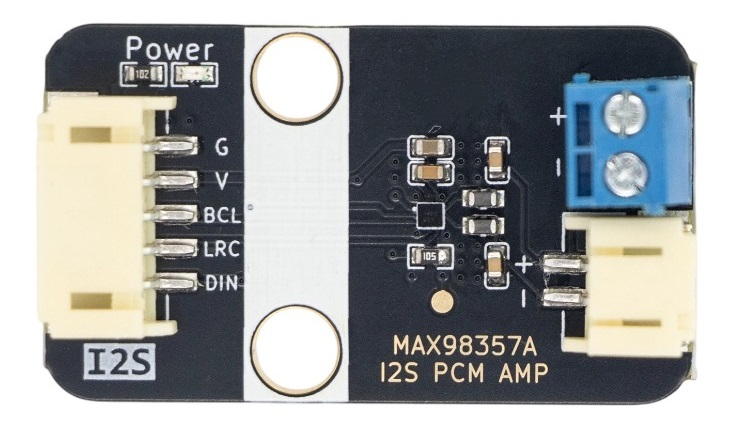
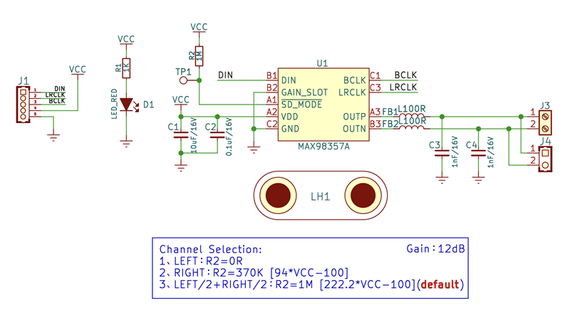
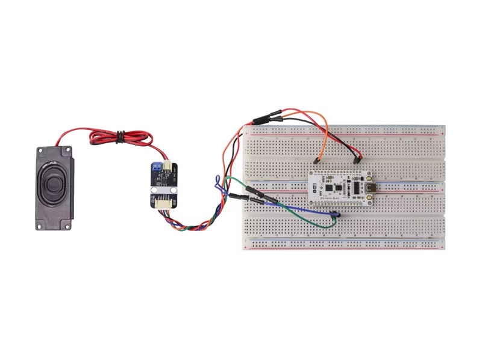
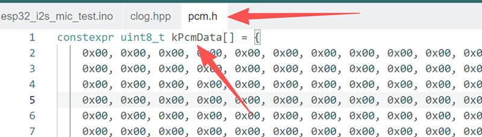

# MAX98357A-module

Physical drawing
---------------------------------------------------------------------------------------------------------------------------------------------------------------------



Overview
----------------------------------------------------------------------------------------------------------------------------------------------------

This amplifier takes digital audio directly through the I2S interface, converts it to PWM inside the chip, and drives the speaker with Class D efficiency. The signal never leaves the digital domain, so you get pristine audio free from analog noise and interference.

## Key features:

* **Filterless Class D Amplifier:** Powered by MAX98357A chip, directly drives speakers without external LC filter
* **I2S Digital Audio Input:** Accepts digital signals directly, no external DAC needed — only 3 signal wires required for audio transmission
* **3W Output Power:** Delivers up to 3W into a 4Ω load for ample volume
* **High-Fidelity Audio:** 90dB SNR and low THD+N of 0.1% for clear,Purity sound quality
* **Wide Voltage Compatibility:** 2.5V ~ 5.5V operating range, compatible with both 3.3V and 5V systems
* **High Efficiency, Low Heat:** Class D efficiency up to 90%+, no extra heat sink required
* **Compatible with Mainstream Boards:** Works with ESP32, Arduino, Raspberry Pi and other I2S-enabled devices
* **Includes 2831 Speaker:** Ready to use out of the box — no need to purchase a separate speaker
* Size: 38.4mm×22.4mm
* Fully compatible with the standard I2S protocol

Schematic
--------------------------------------------------------------------------------------------------------------------------------------------------------------



<a href="./MAX98357A_I2S_AMP_SCH.pdf" target="_blank">Schematic Click here </a>

## Chip specificationsi

[Click here to view the MAX98357A datasheet](./MAX98357AEWL_datasheet.PDF)

[Click here to view the CAD dimension](./MAX98357A_I2S_AMP_3D.step)

## Usage Examples

[Click here to view arduino source](https://app.arduino.cc/sketches/b95650e3-a989-4ea7-b21f-d8a914470fc1?view-mode=embed)

[Click view arduino source](./src)

**Effect:**   Broadcast a Merry Christmas

Ensure that the ESP32 board package version is 2.0.0 or later, or set the framework version to `espressif32@>=2.0.0` in PlatformIO.

```c++
#define CLOG_PREFIX_DATE (0)
#define CLOG_PREFIX_PID (0)
#define CLOG_PREFIX_TID (0)

#include "clog.hpp"
#include "driver/gpio.h"
#include "driver/i2s_std.h"

namespace {
#include "pcm.h"
i2s_chan_handle_t g_tx_handle = 0;
}  // namespace

void setup() {
  Serial.begin(115200);
  CLOGI << "setup";

  // I2S channel config
  i2s_chan_config_t tx_chan_cfg = I2S_CHANNEL_DEFAULT_CONFIG(I2S_NUM_1, I2S_ROLE_MASTER);

  i2s_new_channel(&tx_chan_cfg, &g_tx_handle, NULL);

  // I2S config
  i2s_std_config_t tx_std_cfg = {
      .clk_cfg = I2S_STD_CLK_DEFAULT_CONFIG(16000),
      .slot_cfg = {
        .data_bit_width = I2S_DATA_BIT_WIDTH_16BIT,
        .slot_bit_width = I2S_SLOT_BIT_WIDTH_AUTO,
        .slot_mode = I2S_SLOT_MODE_MONO,
        .slot_mask = I2S_STD_SLOT_BOTH,
        .ws_width = I2S_DATA_BIT_WIDTH_16BIT,
        .ws_pol =false,
        .bit_shift = false,
        .msb_right = true,
      },
      .gpio_cfg =
          {
              .mclk = I2S_GPIO_UNUSED,
              .bclk = GPIO_NUM_33,
              .ws = GPIO_NUM_32,
              .dout = GPIO_NUM_23,
              .din = I2S_GPIO_UNUSED,
              .invert_flags =
                  {
                      .mclk_inv = false,
                      .bclk_inv = false,
                      .ws_inv = false,
                  },
          },
  };

  ESP_ERROR_CHECK(i2s_channel_init_std_mode(g_tx_handle, &tx_std_cfg));
  ESP_ERROR_CHECK(i2s_channel_enable(g_tx_handle));

  size_t bytes_written = 0;
  i2s_channel_write(g_tx_handle, kPcmData, sizeof(kPcmData), &bytes_written, 1000 * 10);

  CLOGI << "setup OK";
}

void loop() {
}
```

**Wiring diagram:**

| ESP32 | I2S Audio Amplifier Module（MAX98357） |
|:-----:|:----------------------------------------------------------------:|
| 3.3V  | VCC                                                              |
| GND   | GND                                                              |
| IO33  | BCLK                                                             |
| IO32  | LRCLK/WS                                                         |
| IO23  | DIN                                                              |



This case can only play PCM encoded arrays with a sampling rate of 16kHz and a bit depth of 16 bits, such as the pcm.h in the example, which is the audio file array for "merry christmas". The file playback size depends on the motherboard's flash size.

**How to convert the encoding?**

1. Install FFmpeg. [click to download](https://ffmpeg.org/download.html) the corresponding version.

2. Configure the FFmpeg environment variables, and then execute the following command in the CMD command line:
   
        ffmpeg -y -i input.mp3 -acodec pcm_s16le -f s16le -ac 1 -ar 16000 output.pcm
   
   **Parameter breakdown:**
   a. **`-y`**
   
       * Automatically overwrite output files without confirmation.
   
   b. **`-i input.mp3`**
   
       * Specifies the input file as `input.mp3`.
   
   c. **`-acodec pcm_s16le`**
   
       * Sets the audio codec to PCM 16-bit signed integer.
       
       * `s16le` = signed 16-bit little-endian.
   
   d. **`-f s16le`**
   
       * Forces the output format to be raw PCM (without a file header).
       
       * Consistent with the codec, ensuring output of pure audio data streams.
   
   e. **`-ac 1`**
   
       * Sets the number of audio channels to 1 (mono).
       
       * If the input is stereo, it will be downmixed to mono.
   
    f. **`-ar 16000`**
   
       * Sets the audio sampling rate to 16000Hz (16kHz).
   
    g. **`output.pcm`**
   
       * Output filename.

3. Convert the output `output.pcm` file into a C language format header file.
   It is recommended to use the xxd dump tool.
   Command: 
   
       xxd -i -C ./output.pcm pcm.h

4. Open the generated pcm.h file, replace the variable names in pcm.h with kPcmData, save the file, and replace the pcm.h in the example.Upload a case and you can play a customized audio file.
   

## Raspberry Pi Application Examples

**Hardware Connection**

| Raspberry Pi | I2S Audio Amplifier Module（MAX98357A） |
|:------------:|:-------------------------------------:|
| GND          | GND                                   |
| 5V/3.3V      | VCC                                   |
| GPIO18       | BCLK                                  |
| GPIO19       | LRCLK/WS                              |
| GPIO21       | DIN                                   |

**Software config**

1. edit config.txt start I2S
   
   ```bash
   pi@pi:~ $ sudo nano /boot/fiemware/config.txt
   ```

2. add or update config.txt
   
   ```bash
   # Uncomment some or all of these to enable the optional hardware interfaces
   #dtparam=i2c_arm=on
   dtparam=i2s=on
   #dtparam=spi=on
   
   #Enable audio (loads snd_bcm2835)
   dtparam=off
   ......
   [all]
   enable_uart=1
   #add dtoverlay
   dtoverlay=hifiberry-dac
   ```

3. restart raspberry pi
   
   ```bash
   pi@pi:~ $ sudo reboot
   ```

4. verifying the Installation `aplay -l`
      sucess output 
   
   ```bash
   pi@pi:~ $ aplay -l
   ......
   card 2: sndrpihifiberry [snd_rpi_hifiberry_dac], device 0: HifiBerry DAC HiFi pcm5102a-hifi-0 [HifiBerry DAC HiFi pcm5102a-hifi-0]
     Subdevices: 1/1
     Subdevice #0: subdevice #0
   ```

5. test audio output `speaker-test -D plug:hw:2 -t wav -c 2`   
   `-D plug:hw:2`   Use the plug plugin to process and output to the hardware device hw:2 (the previous command identified card 2) 
   `-t wav `     test type
   `-c 2`         Set the channel count to 2 and test stereo output
   
   ```bash
   pi@pi:~ $ speaker-test -D plug:hw:2 -t wav -c 2
   
   speaker-test 1.2.14
   
   Playback device is plug:hw:2
   Stream parameters are 48000Hz, S16_LE, 2 channels
   WAV file(s)
   Rate set to 48000Hz (requested 48000Hz)
   Buffer size range from 128 to 131072
   Period size range from 64 to 65536
   Periods = 4
   was set period_size = 12000
   was set buffer_size = 48000
    0 - Front Left
    1 - Front Right
   Time per period = 2.252636
    0 - Front Left
    1 - Front Right
   Time per period = 2.995485
    0 - Front Left
    1 - Front Right
   ```

6. play the specified WAV file      `aplay -D plug:hw:2 test.wav`
   
   ```bash
   pi@pi:~ $ aplay -D plug:hw:2 test.wav
   Playing WAVE 'test.wav' : Signed 16 bit Little Endian, Rate 24000 Hz, Mono
   ```

7. play the specified mp3 file    `sudo apt install mplayer -y` , `mplayer test.mp3`
   
   ```bash
   pi@pi:~ $ sudo apt install mplayer -y
   mplayer is already the newest version (2:1.5+svn38674-2).
   Summary:
   Upgrading: 0, Installing: 0, Removing: 0, Not Upgrading: 281
   pi@pi:~ $ mplayer test.mp3
   MPlayer 1.5+svn38674-2 (Debian)do_connect: could not connect to socket
   connect: No such file or directory
   Failed to open LIRC support. You will not be able to use your remote control.
   Playing test.mp3.
   libavformat version 61.7.100 (external) 
   Audio only file format detected. 
   Clip info:
    Title:
    Artist:
    Album:
    Year:
    Comment:
    Genre: Other 
   
   Load subtitles in ./
   ==========================================================================
   
   Opening audio decoder: [mpg123] MPEG 1.0/2.0/2.5 layers I, II, III 
   AUDIO: 24000 Hz, 2 ch, s16le, 160.0 kbit/20.83% (ratio: 20000->96000) 
   Selected audio codec: [mpg123] afm: mpg123 (MPEG 1.0/2.0/2.5 layers I, II, III) ========================================================================== 
   AO: [pulse] 24000Hz 2ch s16le (2 bytes per sample) 
   Video: no video 
   Starting playback... 
   A: 1.3 (01.3) of 0.6 (00.6) 0.1%
   Exiting... (End of file)
   ```
   
   
